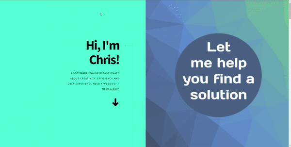
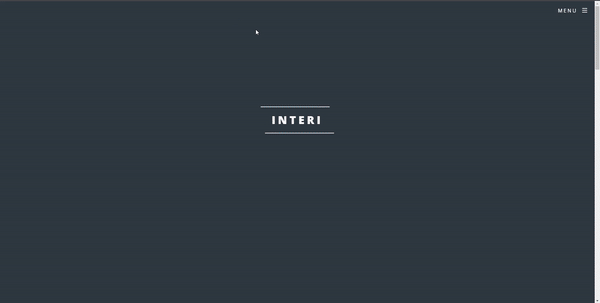

## Recipe Generator: <a href="https://recipe-gen.netlify.app" target="_blank">Check it out here</a>

### Find the next tasty meal to make based on your ingredient!

## Tech Used: 

My learning was focused on understanding how to use APIs to obtain the information I wanted to display to the user. By working with APIs I further familiarzed myself with object-oriented programming. I contined to learn how to access the particular properties necessary based on the goal of my website.

## Optimizations

To improve this project, I would like to perhaps embed the youtube video in the instructions rather than have a link leading to the external Youtube page. 

## Lessons Learned:

I learned how to create a modular pop-up window. To learn how to make this I also learned how to make use of the addClassList method to modify the HTML in a way that ultimately affects the CSS.

## More Projects

<table bordercolor="#66b2b2">
  
  <tr>
    <td width="33.3%"  style="align:center;" valign="top">
<a target="_blank" href="https://github.com/christurc29/Portfolio">Portfolio</a>
         
      
    </td>
    <td width="33.3%" valign="top">
<a target="_blank" href="https://interi-design.netlify.app/"> Interi Agency</a>
       
        
    </td>
    <td width="33.3%" valign="top">
<a target="_blank" href="https://github.com/christurc29/Drink-Selector">Boozgle</a>
         
        
    </td>
  </tr>
</table>

